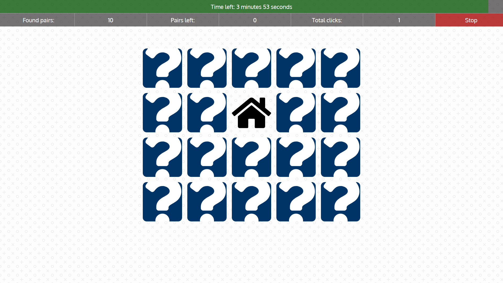
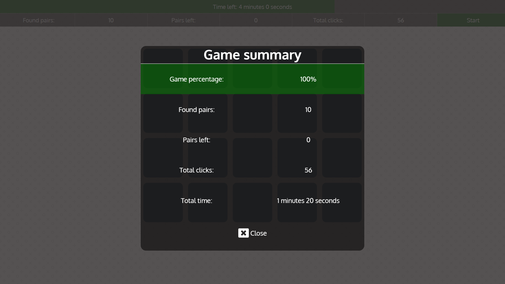

# memoryGame

JavaScript based, match pair memory game

## Functionalities

*

## Tested on following browsers

| Browser  | Version  | Status |
|---|---|---|
|Mozilla Firefox|62|OK|
|Google Chrome|68|OK|
|Opera|55|OK|  

## Screenshots 

## External resources used in project

* Background image provided by: Subtle Patterns, https://www.toptal.com/designers/subtlepatterns/
* All icons in project provided by: Font Awesome, https://fontawesome.com/
* Parts of JS code and some styles, based on code by @taniarascia from project: https://github.com/taniarascia/memory
* Font: Oxygen, created by Vernon Adams, https://fonts.google.com/specimen/Oxygen
